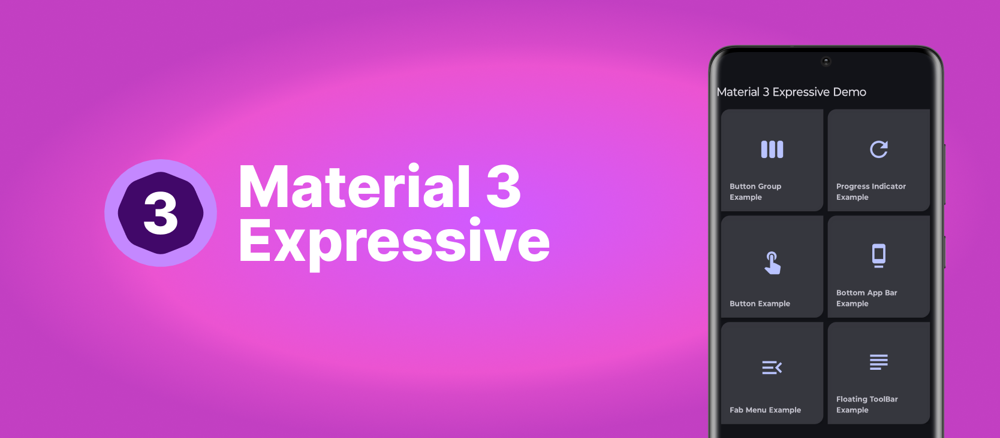
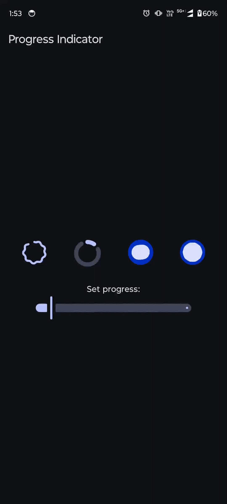
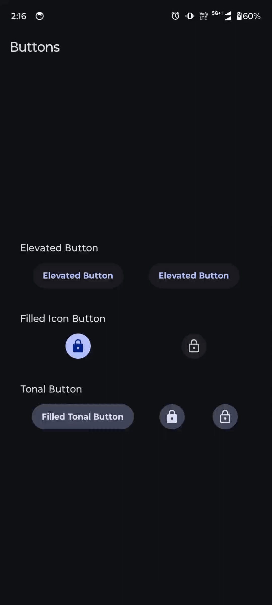
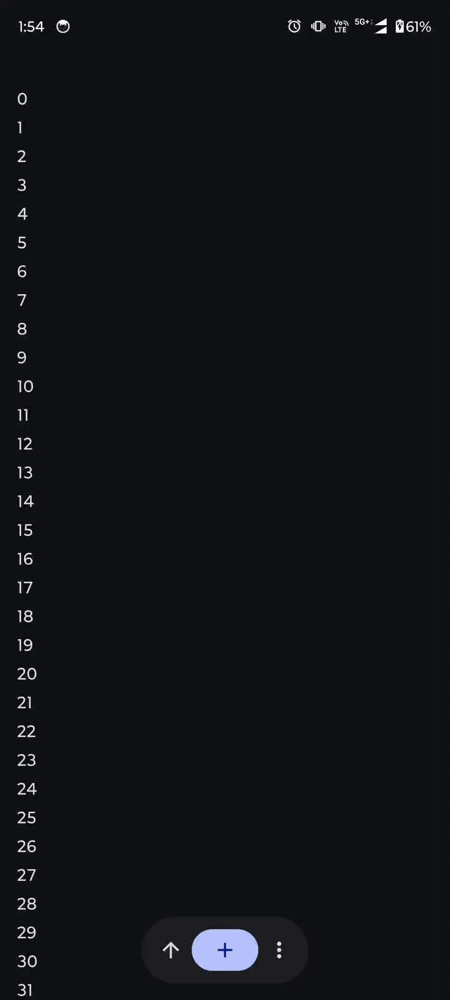

<h1 align="center">Material 3 Expressive Catalog</h1>

<p align="center">
  <a href="https://opensource.org/licenses/Apache-2.0">
    
  </a>
  <a href="https://android-arsenal.com/api?level=31">
    
  </a>
  <a href="https://developer.android.com/jetpack/compose">
    
  </a>
  <a href="https://kotlinlang.org">
    
  </a>
  <a href="https://github.com/cavin-macwan">
    
  </a>
  <a href="https://github.com/cavin-macwan/material-3-expressive-catalog/stargazers">
  
  </a>
</p>

<p align="center">  
A demonstration application showcasing various Material 3 components using expressive UI patterns
built with Jetpack Compose. This catalog serves as a reference for developers looking to implement
modern and expressive user interfaces in their Android applications.
</p>


<p align="center">

</p>

## ✨ Features

* **Jetpack Compose**: Built entirely with Jetpack Compose, Android's modern toolkit for building
  native UI.
* **Material 3 Expressive**: Implements the latest Material 3 expressive components and theming.
* **Interactive Examples**: Provides interactive examples of various components, allowing users to
  see them in action.
* **Modular Code**: Organized by component for easy understanding and reusability.

## 🛠️ Tech Stack & Key Libraries

This project is built using a modern Android development stack, leveraging the power of Kotlin and
Jetpack Compose:

* **UI Toolkit**:
    * [Jetpack Compose](https://developer.android.com/jetpack/compose): Android's modern declarative
      UI toolkit.
    * [Material 3 Expressive Components](https://m3.material.io/blog/building-with-m3-expressive):
      Implementing the latest Material Design guidelines using expressive components.
    * [Material Icons Extended](https://developer.android.com/reference/kotlin/androidx/compose/material/icons/Icons.Filled):
      Providing a rich set of icons.
* **Architecture & Navigation**:
    * [Android Jetpack Libraries](https://developer.android.com/jetpack): Suite of libraries to help
      follow best practices (e.g., ViewModel, Lifecycle).
    * [Hilt for Dependency Injection](https://dagger.dev/hilt/): For managing dependencies in a
      robust and scalable way.
    * [Jetpack Navigation 3](https://developer.android.com/guide/navigation/navigation-3): For
      navigating between composable screens.
* **Data Handling**:
    * [Kotlinx Serialization](https://github.com/Kotlin/kotlinx.serialization): For serializing and
      deserializing Kotlin objects to/from JSON.
* **Build & Development Tools**:
    * [Android Studio](https://developer.android.com/studio): The official IDE for Android
      development.
    * [Gradle](https://gradle.org/): For build automation.
    * [Spotless](https://github.com/diffplug/spotless): For code formatting, configured
      with [KtLint](https://ktlint.github.io/) (including `io.nlopez.compose.rules:ktlint` for
      Compose-specific rules).

## 🖼️ Screenshots

<p align="center">
  
  <br/>
  
  
</p>


## 🚀 Getting Started

1. **Clone the repository:**
   ```bash
   git clone https://github.com/cavin-macwan/material-3-expressive-catalog.git
   ```
2. **Open in Android Studio**
   Open the cloned project in Android Studio.
3. **Build and Run:**
   Build the project and run it on an Android emulator or physical device.

## 🎨 Available Components & Examples

This catalog currently showcases the following Material 3 components and expressive patterns:

* **Buttons**: Various button types and styles.
* **Button Groups**: Examples of standard and connected button groups for selection.
* **Progress Indicators**: Demonstrations of linear, circular, and refresh indicators.
* **Bottom App Bar**: Different configurations of the Bottom App Bar, including variants with
  Floating Action Buttons (FABs).
* **FAB Menu**: Expressive Floating Action Button with menu options.
* **Floating Toolbar**: Contextual toolbars that appear dynamically.

Explore the app to see these components in action!

## 🗺️ Roadmap

- [X] Expand component coverage: Integrate all Material 3 expressive components with comprehensive
  descriptions and usage guidelines
- [ ] Code navigation: Implement direct links from component examples to their corresponding source
  code for easier exploration.
- [ ] Overall polish: Conduct a thorough review and refinement of the entire application for
  improved user experience, performance, and code quality.

## 🌟 Find this repository useful? :heart:

If you found this catalog helpful or learned something from the source code, please consider giving
it a star! 🤩

You can __[follow me](https://github.com/cavin-macwan)__ on GitHub for my next creations!

## 📄 License

```
Designed and developed by Cavin

Licensed under the Apache License, Version 2.0 (the "License");
you may not use this file except in compliance with the License.
You may obtain a copy of the License at

   http://www.apache.org/licenses/LICENSE-2.0

Unless required by applicable law or agreed to in writing, software
distributed under the License is distributed on an "AS IS" BASIS,
WITHOUT WARRANTIES OR CONDITIONS OF ANY KIND, either express or implied.
See the License for the specific language governing permissions and
limitations under the License.
```
